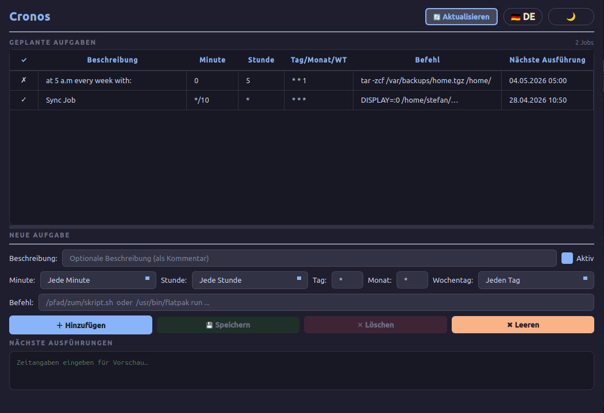
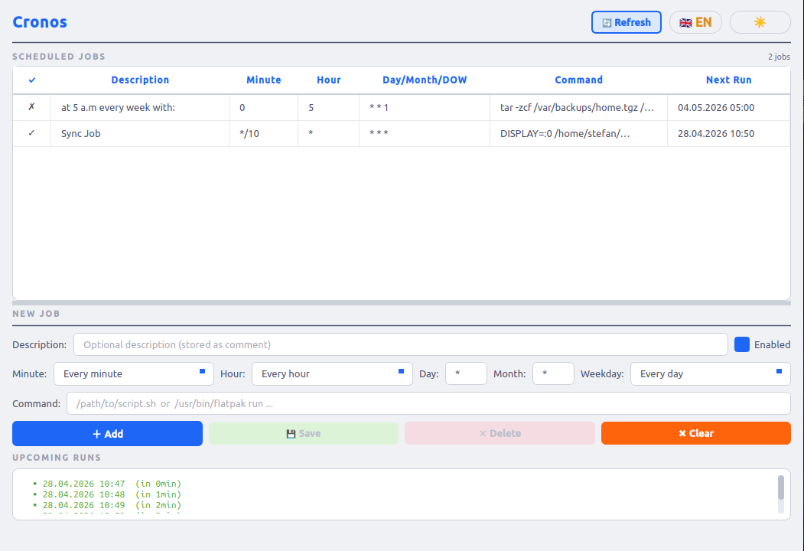

# Cronos 🕐

**A modern, lightweight GUI crontab manager for Linux** — built with Python and PyQt6.


---

## Features

- **View, add, edit and delete** cron jobs without touching a terminal
- **Live preview** of the next 5 upcoming runs (requires `croniter`)
- **Enable / disable** individual jobs without deleting them
- **Automatic next-run refresh** – the table updates itself every 60 seconds
- **Dark & Light themes** using the [Catppuccin](https://github.com/catppuccin/catppuccin) palette
- **German / English UI** – auto-detected from the system locale, switchable at runtime
- **Automatic backups** of your crontab before every change (stored in `~/.local/share/cronos/backups/`)

---

## Screenshots

| Dark mode (German) | Light mode (English) |
|---|---|
|  |  |

---

## Requirements

| Dependency | Version | Notes |
|---|---|---|
| Python | ≥ 3.11 | |
| PyQt6 | ≥ 6.4 | |
| croniter | ≥ 2.0 | Optional – enables the "upcoming runs" preview |

---

## Installation

### ⚡ AppImage (easiest – no installation required)

Download the latest AppImage from the [Releases page](https://github.com/yourusername/cronos/releases):

```bash
chmod +x Cronos-v1.0.0-x86_64.AppImage
./Cronos-v1.0.0-x86_64.AppImage
```

That's it. No Python, no venv, no dependencies. Works on any modern x86_64 Linux.

> **Note:** If you get a FUSE error, install `libfuse2`:
> ```bash
> # Ubuntu/Debian/Mint
> sudo apt install libfuse2
> # Arch/Manjaro
> sudo pacman -S fuse2
> ```

### One-command install (with desktop entry)

```bash
git clone https://github.com/yourusername/cronos.git
cd cronos
bash scripts/install.sh
```

The script will:
1. Create a virtual environment in `~/.local/share/cronos/venv/`
2. Install all dependencies
3. Write a launcher to `~/.local/bin/cronos`
4. Create a `.desktop` entry so Cronos appears in your application menu

Then simply run:

```bash
cronos
```

### Manual / development install

```bash
git clone https://github.com/yourusername/cronos.git
cd cronos
python3 -m venv .venv
source .venv/bin/activate
pip install -e ".[preview,dev]"
python -m cronos.main
```

### Uninstall

```bash
bash scripts/uninstall.sh
```

> Your crontab **is never modified** by uninstalling Cronos.  
> Backups in `~/.local/share/cronos/backups/` are also kept.

---

## Language

Cronos detects your system language automatically on startup by reading the
standard Linux locale environment variables (`LANGUAGE`, `LC_ALL`,
`LC_MESSAGES`, `LANG`) in order of priority.

| System locale | UI language |
|---|---|
| `de_*` | German 🇩🇪 |
| anything else | English 🇬🇧 |

You can also **switch the language at any time** without restarting by clicking
the **🇩🇪 DE / 🇬🇧 EN** button in the header.

---

## Project layout

```
cronos/
├── cronos/
│   ├── __init__.py
│   ├── main.py          # Application entry point & GUI
│   ├── cron_manager.py  # Crontab read / write / parse logic
│   ├── styles.py        # Qt stylesheets (Catppuccin Dark + Light)
│   ├── i18n.py          # Translations & language detection
│   └── assets/
│       └── cronos_icon.svg
├── tests/
│   ├── conftest.py
│   ├── test_cron_manager.py
│   └── test_i18n.py
├── scripts/
│   ├── build_appimage.sh   # Build a self-contained AppImage
│   ├── install.sh
│   ├── uninstall.sh
│   └── appimage/
│       └── cronos.desktop
├── .github/
│   └── workflows/
│       ├── ci.yml          # Lint + test on every push
│       └── release.yml     # Build & publish AppImage on git tag
├── cronos.spec             # PyInstaller build spec
├── pyproject.toml
├── requirements.txt
├── LICENSE
└── README.md
```

---

## Adding a new language

1. Open `cronos/i18n.py`.
2. Add your language code (e.g. `"fr"`) to the `Language` type alias.
3. Add a `"fr": "..."` entry for every key in `_STRINGS`.
4. Extend `detect_system_language()` to recognise `fr_*` locales.
5. Add a flag/label case in `CronGUI._lang_button_label()` in `main.py`.

---

## Running the tests

```bash
# headless (CI / no display)
QT_QPA_PLATFORM=offscreen pytest tests/ -v

# with display
pytest tests/ -v
```

---

## Contributing

Pull requests are welcome!  Please:

- Run `ruff check cronos/` and fix any lint errors before opening a PR.
- Add or update tests for any logic changes in `cron_manager.py` or `i18n.py`.
- Keep the translation keys in `i18n.py` in sync when adding new UI strings.

---

## License

MIT – see [LICENSE](LICENSE).
